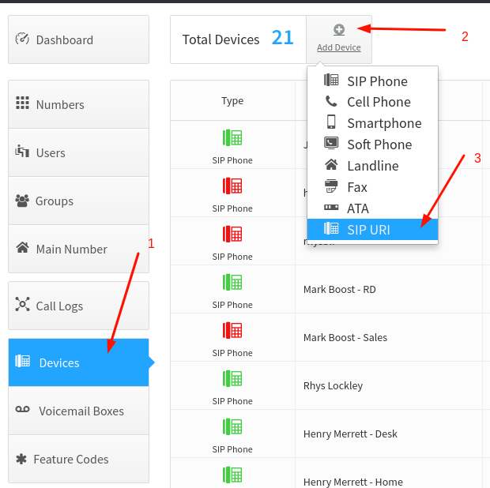

Creating queries
================

Before creating queries reqired to configure users group with queries agents. Example provided on screenshot #1

Steps description:

#) select "Groups" menu;
#) press "Add Group" button and enter name of group, group internal number and add users to group;
#) adjust ring distribution schema.

After users group is created need to define SIP device with type "SIP URI". Example provided on screenhot #2

Steps description:

#) select "Devices" menu;
#) press "Add Device" button and select "SIP URI" device type;

Will be opened dialog, Where need to enter device name and "SIP URI" string. Format of SIP URI string is importand. Correct format `sip:<internal_number>@<REALM>;fs_path=sip:queue.cloudpbx.ai.co.uk`.
Where `internal_number` is number of users group create before and `REALM` is account realm of tenant.

Same way need to add two additional SIP URI devices:

#) agent-login to `sip:agent-login@<REALM>;fs_path=sip:queue.cloudpbx.ai.co.uk`;
#) agent-logoff to `sip:agent-logoff@<REALM>;fs_path=sip:queue.cloudpbx.ai.co.uk`.

Then need to create new callflow and route calls to created SIP device and assign internal or external number. Example  provided on screenhot #3

Steps description:

#) press "Add Callflow" button;
#) select "Advanced" tab;
#) drag "Device" element to callflow schema and drop. Will be opened dialog where need to select created SIP device on prevesion step, and set "Ring this device for" value to 3600 sec;
#) assign internal or external number to callflow.

When callflow is configred need to save callflow. New settings will be applied durring next hour.

Same way need to create callflow with internal number for devices `agent-login` and `agent-logoff`.

Usage instructions
==================

Agants is added to queue with `Logged Out` state. To start call routing to agent need agent loggn by dialing `agent-login` extension. When agent leave seat, is need to dial
`agent-logoff` extension. If agent forget to logoff, then after 10 unanswered call queue server force set agent status `On Break` and stop call routing to agent. To reset
agent status from `On Break` is need make logoff.
